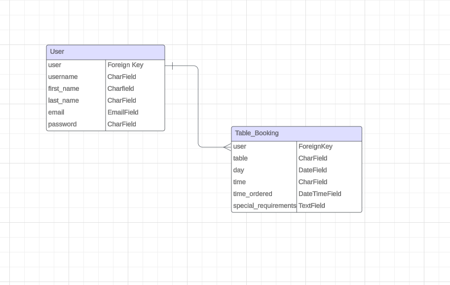
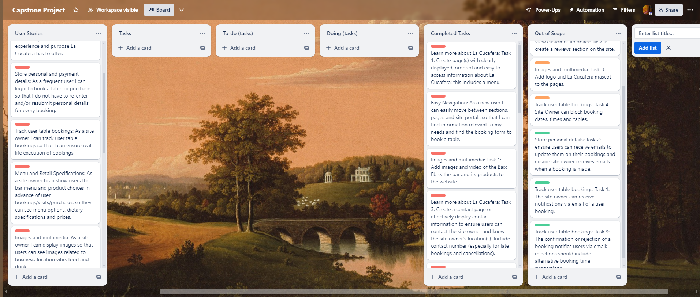

# La Cucafera | A Vegetarian Tapas Bar 

This website has been designed for an imaginary tapas bar, located on a yet to be built street in the heart of Cardiff. They serve vegetarian dishes, as well as a range of beverages inspired by the culinary traditions of the Baix Ebre region in southern Catalonia. 

The site is set up with the intention of providing users with the opportunity to learn more about the business and to be able to book a table prior to visiting. 

Visitors to the site hoping to book a table can choose a date, time and table when making a booking, can cancel or update their bookings, and cannot choose a date, time and table that is already reserved.  

This website is designed with the Baix Ebre in mind; the dishes and beverages on on its menu, the choice of colours, which were inspired by the terracotta and limestone prevalent in the rock formations and Renaissance buildings of the region’s towns and cities. Even the choice of font for titles and headings was chosen because of its similarity to one found on a series of cardboard recipes freely distributed at a local grocers in the region’s capital, Tortosa. The website includes a landing page and a menu page; users can register an account, which extends user access to the table booking system and an individual bookings portal, where users can view, update and delete bookings.

## UX

The site’s design was inspired by the region from which the restaurant’s name comes from — the Baix Ebre. There the Cucafera is a creature thought be half dragon and half tortoise, whose image can be seen mounted on walls and placed on souvenirs throughout the towns and villages of the region. These same towns and villages were also the source of inspiration for the colour palette choices, which were changed during the course of development to find a balance between meeting the lighthouse contrast requirements and staying true to the site’s source of inspiration. I imaged the bar having a generally relaxed atmosphere and tried to make use of fonts and emojis on the pages to reflect this. The navigation bar is kept very simple; a profile icon is fixed to the top right hand corner of the page, which when clicked displays a navigation modal with options for users with a registered account, or if users are not logged in or registered to who log-in or register. Fixed to the top left hand corner is a button reading ‘menu’, which takes all users — registered or otherwise — to the restaurant’s menu page. The website makes use of images of the region and images reminiscent of it; or images relating to food and drink in the context of a tapas bar. 
 
## User Stories

- As a **frequent user** I can **easily make reservations** so that **I can book a table at La Cucafera**. 
- As a **user** I can **learn more about La Cucafera** so that **I know what types of dishes, products and overall experience La Cucafera has to offer**. 
- As a **frequent user** I can **log in to book a table** so that **I do not have to re-enter and/or resubmit personal details for every booking**. 
- As a **site owner** I can **track user table bookings** so that **I can ensure real life execution of bookings**.
- As a **site owner** I can **I can show users the bar menu and product choices in advance of their booking or visit** so that **they can see menu options, dietary specifications and prices**. 
- As a **site owner** I want the site to **display relevant images** so that **users can see images related to the business: location vibe, food and drink**. 
- As a **user who uses a screen reader** I can **have meaningful alt text on images** so that **I can more easily navigate through the site**. 
- As a **site owner** I want **my webpage to look good on all devices** so that users can **access it in different ways.**
- As a **site owner** I can **provide users with necessary information about booking, updating and deleting a table** so that **confusion and issues about bookings are avoided**. 
- As a **user** I can **read, update and delete bookings** so that **I do not have to directly contact the business via phone or email.**. 
- As a **new user** I can **see reviews, ratings and feedback from other customers** so that **I can determine the quality and reliability of the site owner**.
As a **user** I can **contact the business via the website in regards to dietary needs, caring needs and/or disability needs** so that **my needs are not overlooked and to ensure my experience is a positive one**.
flow-chart

## Scope

### High-Level Features

| **Homepage**   | **Table Booking Pages**   | **Bar Menu Page** | **Navigation Bar** | **Footer** | **Message Modals** | **CRUD Modals** | **Login Page** | **Register Page** | **Update Booking Page** | **Update User Details Page** | **Update Password Page**| **User Modal Nav** |
|---|---|---|---|---|---|---|---|---|---|---|---|---|
| Interactive images and information about the site owner  | Select Table Drop-down |  | Bar Menu Button | Bar Contact Info | Close Modal button | Edit and delete buttons | Login input boxes and submit button | Register input boxes and submit button | Select Table Drop-down | Pre-populated editable details form | Password input fields and submit button | Links to login/register |   
|  | Select Day Drop-down |  | Interactive Logo/Home button |  |  |  |  |  | Select Day Drop-down |  |  | Links to Table Booking Form and User Bookings | 
| | Select Time Drop-down |  | User modal button | | | | | | Select Time Drop-down | | | |

|  **Feature** | **Value**  |  **Effort** |
|---|---|---|
| Homepage  | High | Low |
| Table Booking Pages | High | High |
| Bar Menu Page | High | Low |
| Navigation Bar | High | Medium |
| Footer | High  | Low |
| Messages Modals | High  | Medium |
| CRUD Modals | High  | High  |
| Login Page | High  | Medium |
| Register Page | High  | Medium |
| Update Booking Page | High | High |
| Update User Details Page | High  | High |
| Update Password Page | High | High |
| User Modal Nav | High | Medium |

| Feature  |  Priority (1=High/10=Low) |
|---|---|
| Homepage | 5 |
| Table Booking Pages | 1 |
| Bar Menu Page | 4  |
| Navigation Bar | 4  |
| Footer | 5 |
| Messages Modals | 5 |
| CRUD Modals | 3 |
| Login Page | 2 |
| Register Page | 2 |
| User Bookings Page | 3 |
| Update Booking Page | 3 |
| Update User Details Page | 4 |
| Update Password Page | 4 |
| User Modal Nav | 2 |

- __Homepage__

  - The homepage has minimal content on this deployment and with future implementations more content, which would fade in as you scroll down the page, would be added. The page is a landing page and attempts to make use of colours, text, design and imagery to draw the user in and their attention towards the details and links in the landing images – which are different on mobile (portrait image), and tablet and desktop (landscape).

- __Table Bookings Pages__

  - The table booking form (which used John Abdsho Khosrowabadi’s Booking System For A Health Clinic as it’s foundation) keeps in place the two page booking process that Khosrowabadi uses, as it nicely breaks up the booking process and stages the booking process. Rather than having a booking take place with one click, this staging gives the user what was thought to be a more friendly booking experience. On the first page registered users can choose a table and select a date from two drop-down bars. Under the heading is a paragraph informing the user that bookings cannot be updated or deleted through the website on the day of the booking. The user then clicks a button labelled “Continue”, which takes them to the next page with a time drop-down selector and textarea for users to specify any additional special requirements they might have for their booking. The form’s content is positioned at the centre of both pages to draw the user’s eye to the priority content.  

- __Bar Menu Pages__

  - The Menu page has been designed as a two column grid for desktop and tablet devices and as a single column grid for mobile. The catalogue of available options is broken up into relevant sections on the page, while the use of emojis in the menu subheadings attempt to bring a playful and friendly vibrancy to the page that matches the site owner’s own. The menu also addresses the business’s dietary requirements and allergies policy.  

- __Navigation Bar__

  - The navbar sits fixed at the top of each page with the relevant links (home, bar menu, booking form and user bookings pages (and for the site owner: a customer bookings page) for users. The homepage link is stored in the bar logo, which is at the centre of the navbar; the menu is made available by clicking the menu button in the top left-hand corner of the navbar; while the booking form, user bookings and customer bookings for superusers are made accessible via a modal, which is accessed by clicking on the profile icon in the top right-hand corner of the navbar.     

- __Footer__

  - The footer is displayed at the bottom of each page with relevant contact information and opening times clearly detailed and text centrally aligned.   

- __Modals__

  - The modals pages can be broken down into distinct categories of modal – the messages modal, the update and delete bookings modals and the navigation modal. The messages modal appears when the user has made a booking, updated or deleted a booking, when a user successfully or unsuccessfully logs in or registers in or when users have attempted to access a prohibited page etc. The modal pages all have a similar design, using only the heading font (Coiny) for displaying text and with a background that takes up the entire screen.      

- __Login and Registration Pages__

  - The registration and login pages have a similar layout to the table booking pages, with hero images displayed at the top of these pages and the input sections positioned at the centre of each page.
  

- __User Bookings Page and Customer Bookings Page__

  - The User Bookings page displays user information at the top and bookings as cards on the page with the option to cancel or update bookings (as long as the booking is not on the same day the user is accessing the page); otherwise bookings will display without these options and with a message informing the user how to contact the bar should they need to make any last minute changes to their booking. The Customer Bookings page for superusers displays all customer bookings in a table, with all the relevant information – including any special requirements.     

- __Table Bookings Update Pages__

  - To update a table booking users click on the “Edit Booking” button on the booking they wish to update, this will bring up a modal to clarify the decision, before taking users to the update booking form, which is almost identical to the original booking form, with a change of the buttons colours to red and black and the exclusion of any images. These changes are there to help distinguish the update form from the booking form.    

- __User Details and Password Update Pages__

  - After building the pages I had intended to build for my MVP I decided to also include a user details update, which can be accessed via the user bookings page; and a password update page, which also accessed via the user bookings page.  

## Structure 

### Site Wireframes

- These wireframes were built original intended colours for the site, which after testing my site I realised did not meet the contrast criteria; I then used the lighthouse colour selector to find the closest colour to the Burnt Sienna colour in these wireframes to go with my Seashell white. In the end I actually prefer the site with the Seal Brown that replaced the Burnt Sienna.       

- __Desktop__

- __Mobile__

## Surface

### Design

#### Chosen Colours

- A Site palette was chosen that attempted to match the terracotta and limestone colours of the towns, cities and rock formations of the Baix Ebre region and to reflect the fact that the site is for a tapas bar.

- The Palette was created using https://coolors.co/

- The original colours I chose from these palettes were:

#FEF6F1 – Seashell (default background or text colour)

#DB7F50  – Burnt sienna (default background or text colour)

#F8E2D6  – Champagne pink (default modal background colour)

#E6A057 – Butterscotch (navigation banner colour)

- Post-lighthouse testing, I switched Burnt sienna for Seal Brown and left out the Butterscotch. I felt the Seal brown was the closest approximation to the something-approaching-terracotta colour I’d hoped to find in the beginning. 

#### Fonts

- Montserrat for paragraph text.

- Coiny for headings.

The fonts were found on: https://fonts.google.com/

Montserrat is fittingly a mountain region in the north of Catalonia, not far from the Baix Ebre; the two regions are geologically and culturally quite similar.  

Coiny is similar to a font I found on a recipe card from the region; I liked the font on that and looked for an approximate. 

#### Media

Images in general are used on the site to invoke the Baix Ebre landscapes, towns and culinary experience. I used a mix of my own and images found on: https://www.pexels.com/ 

## Technologies Used

- [HTML5](https://en.wikipedia.org/wiki/HTML5)
- [CSS3](https://en.wikipedia.org/wiki/CSS)
- [Javascript](https://developer.mozilla.org/en-US/docs/Web/JavaScript)
- [Python](https://www.python.org/)

## Database Design

Entity Relationship Diagrams (ERDs) serve as a visual aid for understanding the architecture of a database prior to model creation. Recognizing the connections among various tables can streamline project timelines in the long run. 

I used [Lucidchart](https://www.lucidchart.com/) to create my ERD and link users to table bookings.

## Agile Development Process
### Trello Board
I used [Trello](https://trello.com/invite/b/UM398VY7/ATTI411a69d41a02839643448f61b297c130D7B08D32/capstone-project) to keep track of user stories.
The project board was set up as a Kanban board, informing me which features were still to do, which features were in progress whilst being worked on, and which features met the definition of done.
I created the following columns:
  - **Project Targets**
    - Items in this list helped me keep track of project targets. 
- **Project Targets**
    - Items in this list helped me tick off completed targets. 
- **User Stories**
     - Each user story is given a traffic light colour (red = must have, orange = should have and green = could have).
- **Tasks**
      - Each task is related to a user story and was stored in the tasks column until they moved to the “to-do (tasks)” column. 
- **To-do (tasks)**
      - The tasks that needed doing were moved to the to-do column and then as I undertook the challenge of completing them, these were moved to the Doing (tasks) column.
- **Doing (tasks)**
      - The tasks was currently working on lived in the doing column, upon completion they were moved to the Completed Tasks column.
  - **Completed Tasks**    
    - Once an item was completed, it was moved to this column. This way, I could keep track of items which still needed to be addressed, and which ones were completed.
  - **Out Of Scope**
    - Any features which weren't able to be implemented in this iteration were placed in the "Out Of Scope" column. When I thought of a feature which had been referenced during development, but did not make it in the MVP, I placed it in the "Out Of Scope" column.

### User Stories
I created a User Story Template which acted as the backbone for all user stories. Each user story would follow the convention:
***As a (role) I can (capability) so that (received_benefit)***
  > AC 1
  > AC 2
  > AC 3
Here, **AC**, meaning "Acceptance Criteria", were used to conceive of the tasks I had to complete, once a task was completed it was moved to **Done**.
## Frameworks, Libraries & Programs Used

[GitHub](https://github.com/) - Holds the repository of my project.

[GitPod](https://gitpod.io/workspaces) – Workspace. 

[Heroku](https://www.heroku.com/) - Used to deploy this project

[Django](https://www.djangoproject.com/) - Project framework

[Gunicorn](https://gunicorn.org/) - For performance tuning

[Elephant SQL](https://customer.elephantsql.com/) - Holds the project databases.

[Bootstrap](https://getbootstrap.com/) - Used to ensure mobile first design meaning this website is responsive across multiple devices and screen sizes. 

[Google Fonts](https://fonts.google.com/https://fonts.google.com/) - provide fonts for the website.

[Font Awesome](https://fontawesome.com/) - was used for icons.

[OpenMoji](https://openmoji.org/) - was used for emojis

[Balsamiq](https://balsamiq.com/) - was used to create site wireframes.

[Responsive Viewer](https://responsiveviewer.org/) - to check if the site is responsive on different screen sizes.

[W3C Markup Validator](https://validator.w3.org/#validate_by_input) - was used to validate HTML

[W3C CSS Validator](https://jigsaw.w3.org/css-validator/) - was used to validate CSS

[JSHint Validator](https://jshint.com/) - was used to validate JavaScript

## Testing

The La Cucafera site has been tested on Firefox, Chrome and Microsoft Edge.

La Cucafera has been thoroughly tested throughout the development process for responsiveness across a range of devices using developer tools in Google Chrome; early and regular deployment meant the site could also be frequently tested on multiple actual devices in deployment.

### Validating

- HTML

  - La Cucafera has passed HTML validation, where errors occurred these were errors on the inbuilt Django registration form:

  
  
  
  
  
  
  
  
  
  
  
  

- CSS
  - La Cucafera has passed CSS validation:

  

- JavaScript
  - La Cucafera has passed JavaScript validation [JSHint Validator](https://jshint.com/)

  

- Python
  - La Cucafera has passed a Python linter check with #noqa comments on lines of code where the error was to do with code being too lengthy (E501), but which I could not shorten without breaking the site. 

- In the views.py for the booking app this includes lines: 63, 66, 74, 80, 146, 181, 224, 225, 226, 227, 232, 235, 264, 280, 305, 333 and 352. Lines 74, 80, 181, 235, 264 and 352 are already shortened error or success message strings. 7 lines are too long because they belong to two functions with multiple if (one has 7, the other 8) statements; some of these lines are also long anyway, while others are shorter but well indented. The other four lines are long lines.
In the models.py one line was too lengthy and this has been marked with an # noqa (line 48). 
 
I only validated the files which I wrote my own code in. The rest of the code was part of the Django installation package.

From the `booking` app:

| File | Grade |
| ---- | ----- |
| `admin.py` | Pass |
| `models.py` | Pass |
| `urls.py` | Pass |
| `views.py` | Pass |

From the `cucafera` project directory:

| File | Grade |
| -----| ------|
| `urls.py` | Pass |

### Site Testing

#### Link and Feature Testing Results

Screen shots for tested features are available in the “High-Level Features” section above. Here is a table of results for links and features tested:

***LINKS***

| Link | Expected Outcome | Grade |
| ------- | ---------------- | ----- |
| Logo | Navigates to the home page when clicked | Pass |
| Menu/Discover More | Navigate to the menu page when clicked | Pass |
| Profile Icon | Navigates to user navigation modal when clicked | Pass |
| Register | Navigates to a registration form when clicked | Pass |
| Log in | Navigates to a screen where users can log in when clicked | Pass |
| Book a Table/Book a Table! | Navigate to the first page of the table booking form when clicked | Pass |
| Your Bookings | Navigates to a page with user bookings when clicked | Pass |
| Customer Bookings | Navigates to a page all customer bookings when clicked | Pass |
| Update Details | Navigates to a page where users can update their personal information when clicked | Pass |
| Change Password | Navigates to a page where users can change their password | Pass |
| Edit Booking | Navigates to the edit booking modal | Pass |
| Change Booking | Navigates to the first of a two page form where users can modify their booking | Pass |
| Logout | Navigates to a modal confirming the user has logged out | Pass |

***FEATURES***

| Feature | Expected Outcome | Grade |
| ------- | ---------------- | ----- |
| Messages | A message will appear informing the user of a successful or unsuccessful action in a modal | Pass |
| User logged in | In the navigation modal the user sees registered user options and logout option only when logged in | Pass |
| See bookings | Users can see bookings which they have created | Pass
| Make a booking | Creating a booking will add a unique booking to the database | Pass |
| Make unique booking | No other user can make a booking that already exists | Pass |
| User can update bookings | Users can modify bookings as long as the booking is not on that same day of modification | Pass |
| Users can delete bookings | Users can delete bookings as long as they are not on the same day | Pass |
| Customer Bookings | superuser can view all customer bookings in a table | Pass |
| Unique edit of booking | Users can only modify or delete bookings they have made | Pass |
| User can update details | Users can modify their details | Pass |
| User can change password | A user can change their password | Pass |
| User bookings display | A user can see the day, time and table they have booked | Pass |
| Registration | New users can access a registration form from the "Register" link | Pass |
| Log in | Users can log in using a form after clicking "Log in" | Pass |
| Log out | Users get logged out after clicking "Log out" | Pass |
| Pagination | Each booking is displayed to the user on an individual page, a page for each booking they have made | Pass |
| Functional buttons | Edit, delete, create buttons will be functional throughout the site | Pass |
| Footer | A footer displays contact information and opening times | Pass |

### Lighthouse Testing

- Lighthouse tools were used to test the website. During the testing process labels are forms were not identified by lighthouse, despite them being there. I tried changing the layout of the labels in the forms to no effect, however the labels are definitely there. The hero images on the booking forms pages and the register user form page were removed at this stage to improve performance speeds.   

#### Desktop:

  
  
  
  
  
  
  
  
  
  
  
  
  

#### Mobile:

  
  
  
  
  
  
  
  
  
  
  
  
  

## User Story Testing

1. As a **frequent user** I can **easily make reservations** so that **I can book a table at La Cucafera**. 

- The website has a table booking form which can be easily accessed via a link in the navigation bar or through a link on the homepage landing image. The booking form allows registered users to easily make table reservations via a two page booking form. 
 
2. As a **user** I can **learn more about La Cucafera** so that **I know what types of dishes, products and overall experience La Cucafera has to offer**.

3. As a **site owner** I can **show users the bar menu and product choices in advance of their booking or visit** so that **they can see menu options, dietary specifications and prices**.

4. As a **site owner** I want the site to **display relevant images** so that **users can see images related to the business: location vibe, food and drink**.   

- User stories 2, 3 and 4 are met through the website’s menu page which all users can easily access via a link in the navigation bar and a link on the homepage. All users can view all menu options. The site displays a range of images, colours and emojis which all attempt to convey to the user a general sense of what La Cucafera is. The menu details the bar’s allergies and dietary requirements policy and the booking form has an optional special requirements section, which the site owner can view in the customer bookings table. 

5. As a **user** I can **contact the business via the website in regards to dietary needs, caring needs and/or disability needs** so that **my needs are not overlooked and to ensure my experience is a positive one**.

6. As a **frequent user** I can **log in to book a table** so that **I do not have to re-enter and/or resubmit personal details for every booking**. 

- Users have to register an account with basic details such as first and last name, and email address. Once a user is registered they can make a booking, which requires no further personal information – except special requirements, which could vary for customers from booking to booking. 

7. As a **site owner** I can **track user table bookings** so that **I can ensure real life execution of bookings**.

- The superuser can view all customer bookings on a simple table display, which orders bookings according to the dates they’re scheduled for. Superusers do not have CRUD functionality over user bookings. In this iteration users could only be informed of a superuser cancellation of their booking if they returned to the site before their scheduled booking —  and I anticipated that many users would likely not return to the site before their booking, making edit and delete functionality for superusers somewhat redundant. Instead in a future iteration the superuser would be given the option of blocking bookings for specific tables, times or dates to prevent user bookings, this would allow for more wiggle-room when it comes to opening times, i.e. if for whatever reason La Cucafera wasn’t going to be open on one of its usual open days, for the whole day, half the day or an hour or two, bookings could be blocked out. It was decided that any other form of superuser cancellation or alteration within the site to cancel bookings should involve direct contact with the user.      

8. As a **user who uses a screen reader** I can **have meaningful alt text on images** so that **I can more easily navigate through the site**. 

- Every attempt has been made to make the site accessible to screen readers with the use of alt text in all images, aria-labels, and labels on forms. In regards to accessibility, the colour scheme for the website was changed to improve the contrast between colours for users who have difficulty with colours. The lighthouse test flagged my forms for not having labels, which they do. I tried adjusting the format, layout and content of my labels, but couldn’t resolve this issue, nonetheless labels are indeed there.      
 
9. As a **site owner** I want **my webpage to look good on all devices** so that users can **access it in different ways.**

- Every attempt has been made to make the site as responsive as possible on all devices. The landing hero image is differs depending on horizontal or vertical views and width-size.. 

10. As a **site owner** I can **provide users with necessary information about booking, updating and deleting a table** so that **confusion and issues about bookings are avoided**.

- Users are informed under the heading “table booking” on the first page of the booking form that cancellations and updates to bookings cannot be made on the same day that the booking is scheduled for, while on the user bookings page, when it is the same day as the booking, users are informed that last minute booking changes must be made over the phone and the buttons for editing and deleting a booking are not displayed.  

11. As a **user** I can **read, update and delete bookings** so that **I do not have to directly contact the business via phone or email.**.  

-  Users can view their bookings by following the “Your Bookings” page link in the navigation bar. This page allows users to view/read, cancel/delete, and update/edit their bookings. Users are given the opportunity to return to the bookings page after clicking the edit and delete buttons by way of a modal, which ensures the user has to confirm their actions concerning editing or deleting bookings.  

### Features For Future Implementation

1. - As a **new user** I can **see reviews, ratings and feedback from other customers** so that **I can determine the quality and reliability of the site owner**.

-  In the next iteration a reviews model would be added to the site. It would ideally allow users to create reviews and it would in turn display reviews made by customers on the homepage. 

2. - As a **site owner** I can **directly upload images of the bar to a gallery page** so that **I can show the bar to customers**.

-  The site is connected to Cloudinary and could accommodate this user story in a future iteration. Although Cloudinary is not being used, it has been kept in the site for future use.

3. As a **user** I can **learn more about La Cucafera** so that **I know what types of dishes, products and overall experience La Cucafera has to offer**.

- Although there is scope for this in the site it is limited. In a future iteration it would be nice to expand the homepage and add a fade in when users scroll down; images and content would display as the user moves down the page. This would inform users in more detail about dishes, products and offers. 

### Future Fixes: Tested Bugs

- The user stories in the future implementations section above attempt to address the current limitations of the site in its MVP form. 

- In addition to these, late into development I conceived of a fix to superuser control over bookings, which would involve providing superusers with the option of blocking bookings. This would be a must have in a next iteration. This would allow superusers to block weeks, days, or hours through the site. 

- Future implementations would also hopefully also address the issues mentioned in the following section.  

## Known Issues and Bugs

- Ideally user accounts would be connected to user emails to provide users with automated confirmation of their bookings and to notify users of their booking the day before their visit. Connecting accounts to user emails would also address the issue of users retrieving or changing their passwords should they forget them and be unable to access their accounts. It would also deter malpractice when making a booking (i.e. users prank booking by booking all the tables for the entire a day); another safeguard against malpractice might also be to have a system that takes card details and informs users that £5 will be deducted for any booked table that is left empty without notifying the bar.      

## Deployment

The site was deployed to Heroku. 

The live link can be found here:

[La Cucafera | Veg Tapas](https://jsith90-capstone-project-76c37dfc8c1e.herokuapp.com/)

### ElephantSQL Database

For the database, this project utilises [ElephantSQL](https://www.elephantsql.com), a PostgreSQL database service.

An instance was set up using ElephantSQL, and it was integrated into the Django project. The ElephantSQL database serves as the repository for incoming user data and table bookings. 

### Heroku Deployment

This project uses [Heroku](https://www.heroku.com), a platform as a service (PaaS) that enables developers to build, run, and operate applications entirely in the cloud.

The deployment process on Heroku involved the following steps: 

1. Creation of a new app on Heroku.
2. Selection of a unique app name and region.
3. Utilization of the "Create App" option.

Within the local workspace: 

1. Installation of Gunicorn.
2. Generation of a requirements file using pip3 freeze --local > requirements.txt.
3. Creation of a Procfile.
4. Inclusion of a deployment line for Heroku in the Procfile: web gunicorn cucafera.wsgi.

Returning to Heroku: 

1. Navigating to the "Settings" tab.
2. Revealing and configuring environmental variables.
  - `CLOUDINARY_URL`
  - `DATABASE_URL`
  - `SECRET_KEY`
  - *These variables were also stored in an ignored env.py file for security.*

4. Integration with GitHub for automatic deployment. 
  - Accessing the "Deploy" tab. 
  - Selecting "GitHub" as the deployment method. 
  - Providing the repository URL. 
  - Verifying deployment from the "main" branch. 
  - Initiating deployment by clicking "Deploy Branch". 
  - Opened the app to ensure it was successfully deployed
  - Verification of successful deployment by opening the app.

## Worth mentioning

I set up two repositories - one ofr drafting my database models, views and urls etc. and this repository for what would be the project's main repository; here is a link to the [draft repository](https://github.com/jsith90/capstone-models-draft). 

## Credits 

- [Readme Editor](https://readme.so/editor) for helping me create my README.md
- [Chat GPT](https://chat.openai.com/) for simple debugging and planning. 
- [Stack Overflow](https://stackoverflow.com/) for helping debug more difficult issues
- [Django Docs](https://docs.djangoproject.com/en/5.0/) for in detail explanations on views, models, urls, etc.
- [W3Schools](https://www.w3schools.com/) for providing guidance on the custom 404 page and JS modals, which have been used in this project. 
- [Lucidchart](lucidchart.com) for creating my flowcharts and ERD.
- [Am I Responsive](https://ui.dev/amiresponsive) for the responsive test screenshot.

### Acknowledgements

The models, views and html for my table booking system owe a huge debt to John Abdsho Khosrowabadi’s Booking System For A Health Clinic. A debt is also owed to my cohort leader Iris for suggesting I follow Khosrowabadi’s model for a booking system and for sharing his article on building a bookings system with me. Khosrowabadi’s project provided the ideal foundation for building my own table booking system and meeting the requirements as imagined in my user stories. The table booking system in this project would not have taken the shape it has without Khosrowabadi’s instructions, advice and code, which were key to the creation of this project.   

[Medium – Django Tutorial On How To Create A Booking System For A Health Clinic](https://blog.devgenius.io/django-tutorial-on-how-to-create-a-booking-system-for-a-health-clinic-9b1920fc2b78)

Another debt is owed to John Elder and the CODEMY.com YouTube content. While completing the Code Institute LMS series on Python and Django, I also followed CODEMY.com YouTube video tutorials on the subject (Django Wednesdays). In this project I followed Elder’s example in setting up user accounts, adding login and registration functionality and adding user authentication to a website. The members model in this project is largely taken from these tutorials and the pagination functionality on the user bookings pages is from these tutorials.    

[Django Wednesdays YouTube Playlist – Codemy.com](https://www.youtube.com/watch?v=HHx3tTQWUx0&list=PLCC34OHNcOtqW9BJmgQPPzUpJ8hl49AGy)

The custom 404 page and JS modals for this project were created using the “How to -CSS/JS Modal” code on W3 schools, or adapted from this code with the help of stack overflow.  
[W3 Schools CSS/4040](https://www.w3schools.com/howto/howto_css_modals.asp) 
[W3 Schools CSS/JS Modal](https://www.w3schools.com/django/django_404.php) 

Further assistance gratefully received from my capstone project mentor Chris Quinn, CI tutors Iris, Kevin and Martin, and the wider CI slack community. 

I also owe a debt of acknowledgement t the Hard-Lines cafe website and Chapter Arts ‘Food and Drink’ webpage, which I modelled my own website layout and design on. I also recommend paying a visit to both establishments if ever you’re in the Cardiff area.

[Hard-Lines Cafe](https://hard-lines.co.uk/)
[Chapter Arts Centre](https://www.chapter.org/about/what-is-chapter/food-drink)

This site is largely inspired by the Baix Ebre region in Catalonia, where the real Cucafera lives and where much of the tapas in the restaurants is not vegetarian, even though many traditional home cooked dishes are.  

Of course my partner Florence, friends and family.   

### Media

Images that are not my own were taken from:
[Pexels](https://www.pexels.com/) and
[OpenMoji](https://openmoji.org/) 
- All emojis are from OpenEmoji 
- All photos from Pexels, except the hero images on the landing page and the hero image on the menu page, which I took. 
	
Responsiveness tested on Am I Responsive, Dev Tools and my own devices:
[Am I Responsive](https://ui.dev/amiresponsive)

### README Content

The layout and contents of this README.md file are in large part influenced by the [CyberPixels](https://github.com/Libbu/CyberPixels/blob/main/README.md) README.md file from 1st Gwent group Hackathon project and doctypeKieran’s [README.md](https://github.com/doctypeKieran/ci-capstone-project?tab=readme-ov-file), from the ci-capstone-project repository on Github